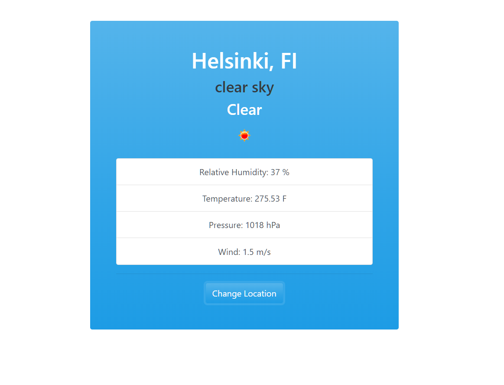
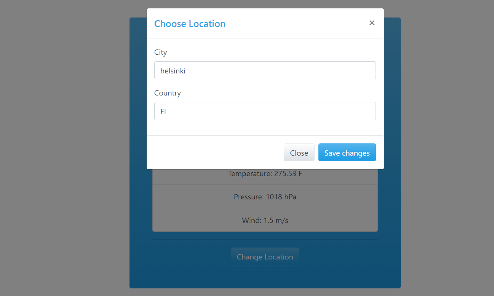

This Weather app is built with Vanilla_JavaScript using object oriented programming. UI of this app is done with Bootswatch css. 
User can make a request to open weather api and can request the data for the city. User can change the location and can have different cities weather info. Local storage has been used to save the user data.
This app is using promises and callbacks plus "async and await". "fetch" is used to get the data from openweather api.

Live Demo: https://shoaibjalal.github.io/WeatherApp/

